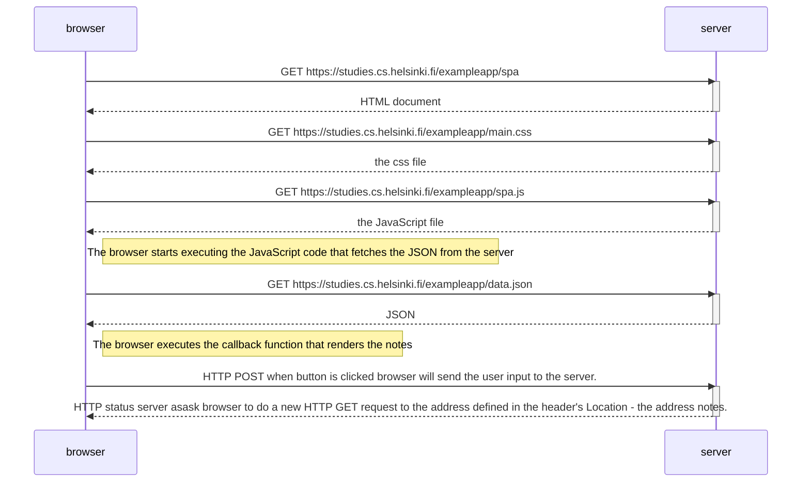

```mermaid 
sequenceDiagram
    participant browser
    participant server

    browser->>server: GET https://studies.cs.helsinki.fi/exampleapp/spa
    activate server
    server-->>browser: HTML document
    deactivate server
    
    browser->>server: GET https://studies.cs.helsinki.fi/exampleapp/main.css
    activate server
    server-->>browser: the css file
    deactivate server
    
    browser->>server: GET https://studies.cs.helsinki.fi/exampleapp/spa.js 
    activate server
    server-->>browser: the JavaScript file
    deactivate server
    
    Note right of browser: The browser starts executing the JavaScript code that fetches the JSON from the server
    
    browser->>server: GET https://studies.cs.helsinki.fi/exampleapp/data.json 
    activate server
    server-->>browser: JSON
    deactivate server    
    Note right of browser: The browser executes the callback function that renders the notes


    browser->>server: HTTP POST when button is clicked browser will send the user input to the server. 
    activate server
    server-->>browser: HTTP status  server asask browser to do a new HTTP GET  request to the address defined in the header's Location - the address notes.
    deactivate server
```