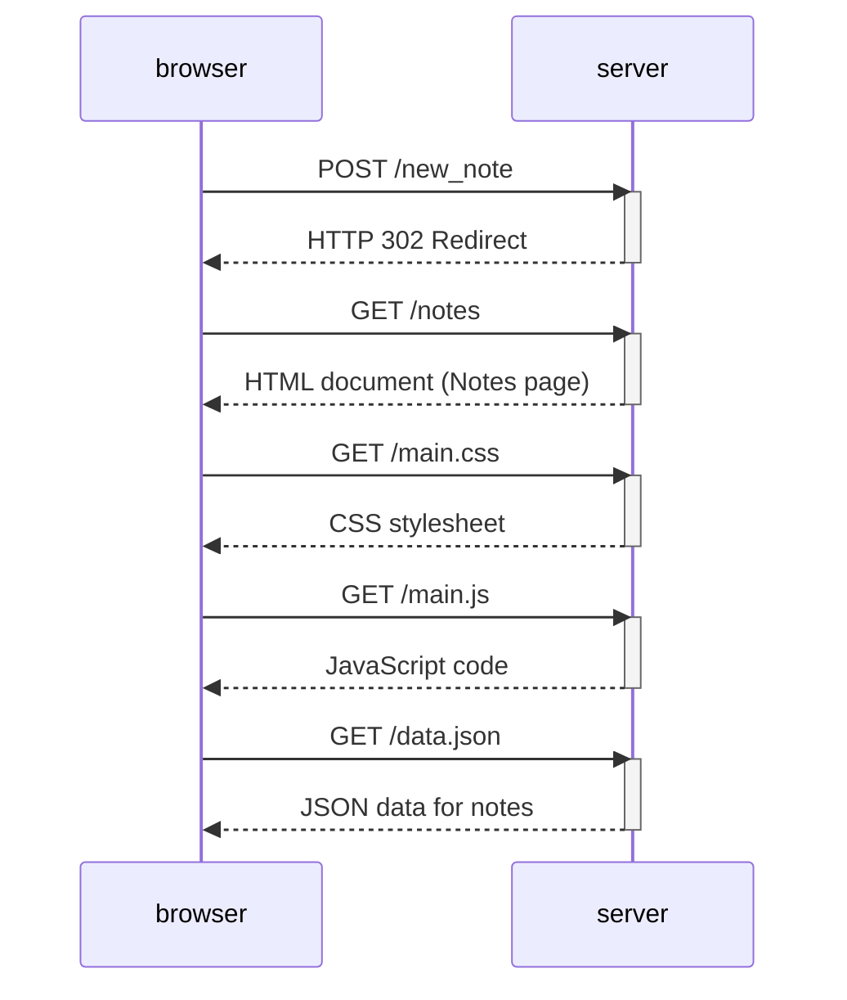

```mermaid
    sequenceDiagram
    participant browser
    participant server

    browser->>server: POST /new_note
    activate server
    server-->>browser: HTTP 302 Redirect
    deactivate server

    browser->>server: GET /notes
    activate server
    server-->>browser: HTML document (Notes page)
    deactivate server

    browser->>server: GET /main.css
    activate server
    server-->>browser: CSS stylesheet
    deactivate server

    browser->>server: GET /main.js
    activate server
    server-->>browser: JavaScript code
    deactivate server

    browser->>server: GET /data.json
    activate server
    server-->>browser: JSON data for notes
    deactivate server


```